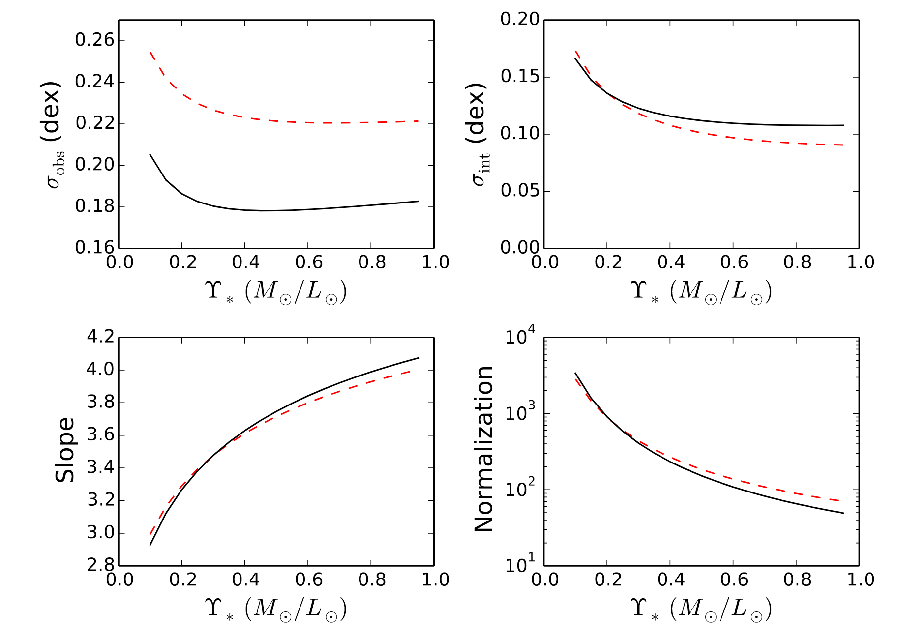
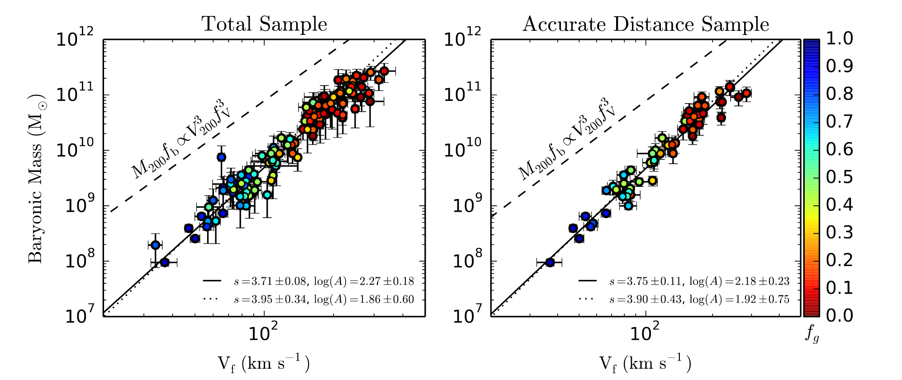
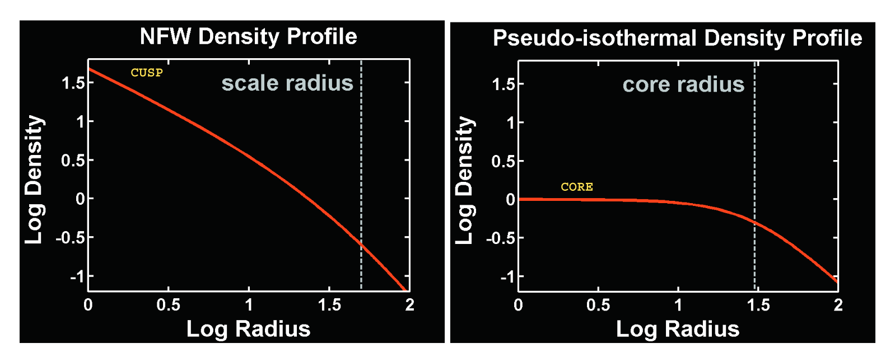
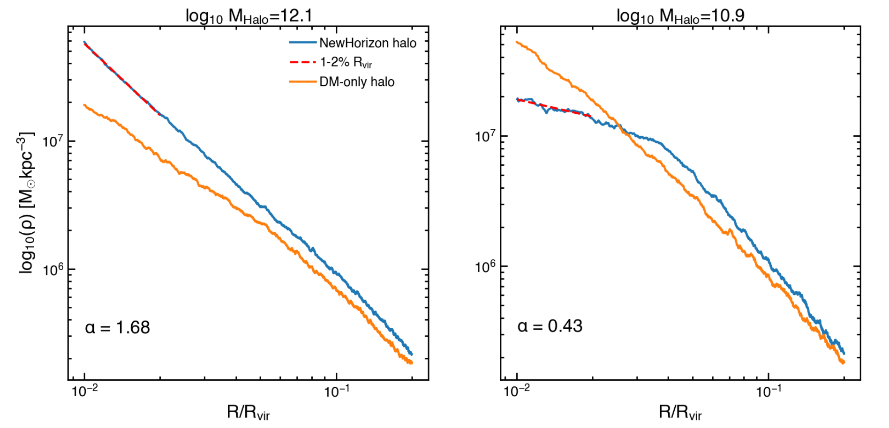
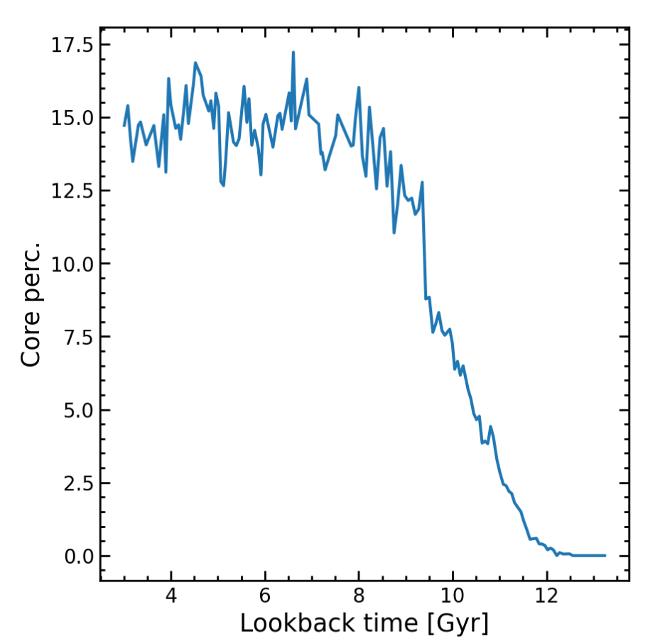
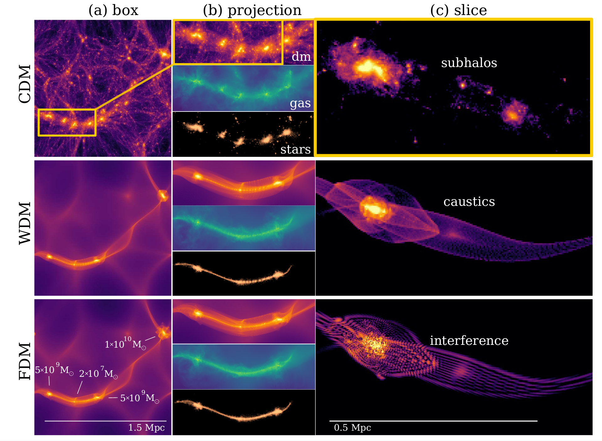
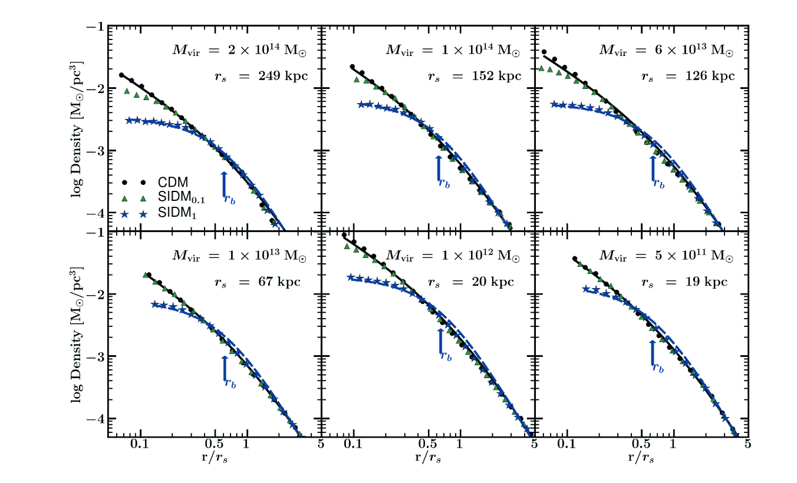
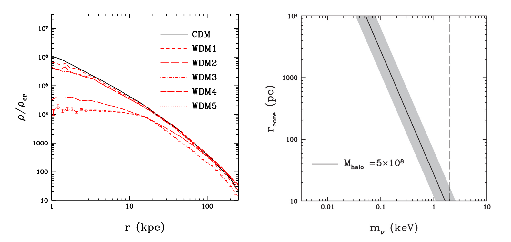
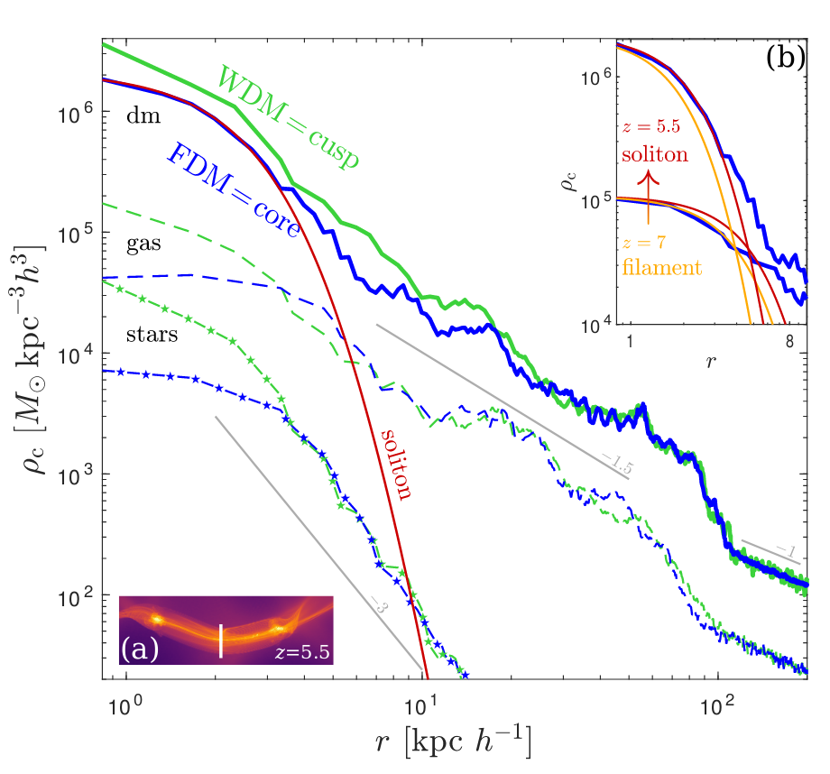

# The Baryonic Tully-Fisher Relation Problem
BTFR通常表示为一个幂律关系:
$$M_b = A * V_f^η$$

其中:\
    $M_b$是星系的重子质量 \
    $V_f$是星系旋转曲线的平(flat)速度:是指旋转曲线平坦部分的平均速度,以 $V_f$ 作为BTFR分析的速度参数,比使用某个半径处的速度更能最小化BTFR的涨落\
    $A$是归一化系数\
    $\eta$是斜率slope

BTFR内在涨落远低于ΛCDM模型预期,存在如下冲突:

1. ΛCDM模型预测:
   - 由于暗物质晕的质量-浓度关系,以及暗物质和普通物质比例的涨落,BTFR应该具有较大的内在涨落,最小预期值为0.15 dex

2. 观测结果:
   - 考虑合理的测量误差后,BTFR的内在涨落只有0.10-0.11 dex,远低于ΛCDM预期
   - 这一结果对于不同的距离测量样本都成立,表明结果是稳健的

3. 冲突分析:
   - ΛCDM模型无法解释观测到的BTFR如此小的内在涨落
   - 这意味着ΛCDM模型无法完全描述复杂的星系形成过程
   - BTFR的小涨落暗示了一种更简单、更确定的star-halo关系,这对ΛCDM框架提出了挑战

4. 启示:
   - BTFR微小的内在涨落可能反映了一种更基本的物理过程
   - 这需要ΛCDM模型在描述星系形成时做出重大修正
   - 从而BTFR成为检验ΛCDM模型的一个关键观测事实

- 上左: 观测离散度$\sigma_{\mathrm{obs}}$：
随着$\Upsilon_*$的增大,$\sigma_{\mathrm{obs}}$呈现出减小并达到plateau的趋势, 对于精确距离样本,$\sigma_{\mathrm{obs}}$明显小于完整样本,表明距离测量误差是观测离散度的一大来源

- 上右: 内在离散度$\sigma_{\mathrm{int}}$：
对于任何合理的$\Upsilon_*$取值,$\sigma_{\mathrm{int}}$都低于0.15 dex，小于ΛCDM模型预期的最小值；两个样本的$\sigma_{\mathrm{int}}$相似,说明作者使用的Hubble流距离误差估计是合理的

- 下左: 斜率 $s$ ：斜率随$\Upsilon_*$单调增加。这是由于气体质量分数$f_{\mathrm{g}} = M_{\mathrm{g}} / M_{\mathrm{b}}$系统地随旋转速度变化造成的

- 下右: 归一化 $\log A$：归一化随$\Upsilon_*$单调减小。这也与气体质量分数$f_{\mathrm{g}}$的系统变化有关

- **红色和黑色线分别代表总距离样本和精确距离样本**

- 左图：采用 $\Upsilon_* = 0.5 M/L$ 时的BTFR实线为加权拟合,权重为测量误差，虚线为进一步增大气体主导星系权重的拟合

- 右图：BTFR的规范化和斜率，斜率接近 4；这与ΛCDM模型的预期不符，规范化偏离ΛCDM假设的fb = 0.17（旋转速度与暗物质晕的virial速度之比）和fV = 1（表示星系中重子物质质量与宇宙学重子物质总量的比例）的初始条件

ref. Lelli, F., McGaugh, S. S. & Schombert, J. M. The small scatter of the baryonic Tully-Fisher relation. ApJL 816, L14 (2016).

# The Cusp/Core Problem
## CC问题:
CDM模型得到的物质密度轮廓在中心成幂率模式
$$
\rho(r)\propto r^{-\gamma}
$$
在CDM模型中$\gamma\approx0.8-1.4$是一个尖峰(cuspy)，而世纪观测到的更平$\gamma\approx0-0.5$是一个核的状态

N体模拟预测暗物质密度轮廓呈现向心尖点(cuspy)分布,而观测发现矮椭圆星系、不规则星系和低表面亮度星系的暗物质密度分布实际上是平坦的(cored)的矛盾。即观测的暗物质密度分布和模拟出的暗物质密度分布存在偏离。

ref. Del Popolo, A. & Delliou, M. L. Small scale problems of the $\Lambda$CDM model: a short review. Galaxies 5, 17 (2017).

arXiv:astro-ph/9508025

早期讨论:

- Flores & Primack以及Moore最早发现观测的星系旋转曲线与N体模拟预测的cuspy暗物质密度轮廓不符。

- 后续N体模拟研究表明,CDM模型下暗物质密度轮廓的内部幂律指数α=-1(NFW轮廓)或-1.5,与观测不符。

- 一些研究发现α值会随暗物质晕质量而有所变化,但仍普遍不能匹配观测的cored分布。

## 解决方法
### LCDM 上的改进
Supernovae Feedback Flattening-超新星反馈效应可以扁平化暗物质密度分布

星形成和超新星爆发等物理过程产生的反馈效应。这些过程可以改变暗物质分布,将尖峰型轮廓转化为核心状密度分布。

    左图显示了一个类似于NFW轮廓的暗物质晕(斜率为1.68)。相比于只有暗物质的模拟,NewHorizon模拟中包含重子物质后,中心区域的密度进一步增大,因为重子物质加深了引力势。

    右图显示了一个具有核心(core)结构的暗物质晕(斜率为0.43)。与只有暗物质的模拟相比,NewHorizon模拟中暗物质从中心区域被推到了较大半径,形成了平坦的密度轮廓。

    这表明NewHorizon模拟不仅能够产生"核芯"式的暗物质密度分布,也能够产生"核"式的平坦密度轮廓。

    作者用红色虚线标出了计算密度斜率的区域。

我们看到，核心的频率在最后〜9 Gyrs中相对恒定，这表明要么核心一旦形成，它们就有弹性并且难以破坏，要么核心不断形成以补充那些被破坏的核心。在最后一个时间步，我们发现~70% 的核心已经存在了至少 3 Gyrs，这意味着大多数核心的寿命相对较长。然而，在此之前，核心很少甚至没有。事实上，正是在宇宙恒星形成开始增加然后达到顶峰的时期（Madau & Dickinson 2014），核心的数量开始迅速增加。这不仅让光晕有时间增长到能够维持核心的质量，而且还表明恒星形成在核心形成中起着关键作用。
1. Jackson, R. A. et al. The formation of cores in galaxies across cosmic time -- the existence of cores is not in tension with the LCDM paradigm. Preprint at http://arxiv.org/abs/2310.13055 (2024).

Gas Clumps Merging-在星系形成过程中,气体产生的大尺度团块通过相互合并和动力学摩擦过程,能够有效地转移角动量,从而解决ΛCDM模型在模拟星系盘结构时出现的"角动量灾难"问题。

### 暗物质模型修改

#### SIDM
引入自相互作用暗物质(SIDM)。Spergel和Steinhardt[190]首次提出SIDM,认为暗物质粒子之间的弹性散射可以抑制暗物质在中心区域的聚集,从而形成核心态密度分布。

#### WDM

将 NFW（黑线）和 Burkert（蓝线）密度剖面与 SIDM 宇宙的模拟进行比较，表示为 SIDM1（蓝星）和 SIDM0.1（绿色三角形）分别。
# FDM

这张图是纤维的一个径向密度轮廓，可以看出WDM在小半径处也是个尖峰，FDM则更平滑，是个核球型的，这也导致其第一批星系比另外两个更暗，也就是形成的恒星更少。由于量子压的支撑，FDM可以抵抗暗物质的自引力，结果就是在晕中心会形成一个半径为几kpc的球型孤子核。而WDM中，缺少量子压，如果考虑热运动速度，这一尖峰最终会形成一个10pc的核。显然这比FDM的尺度小了很多
### 修改引力理论
最著名的是MOND理论(Modified Newtonian Dynamics)[70],它引入了一个基本加速度标度,可以自然解释观测到的BTFR关系。

MOND假设在低加速度区域,引力规律不再遵循牛顿定律,从而可以避免形成暗物质尖峰。Milgrom[194,195]给出了MOND的基本公式,并指出它可以更好地解释dwarf星系和LSB星系的旋转曲线。