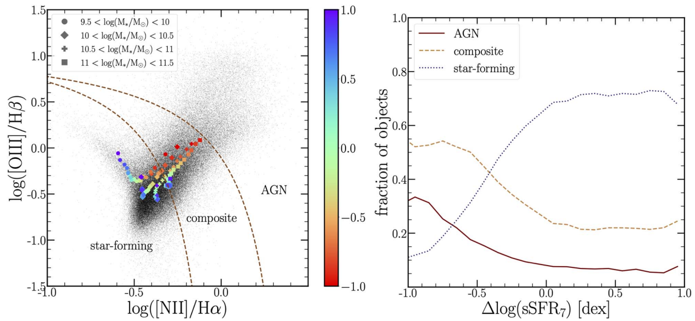

<!-- _header: . -->
<!--_paginate: false -->/* 是否显示页码的意思 */

### 星系的形态与分类

##### 黄震洋、邓静一、王泽毅、付泽华
###### 2024-06-04

---

<!--_paginate: true -->

## 目 录

#### 哈勃分类
#### 哈勃音叉
#### 星系特征
#### 透镜状星系形成机制
#### 关于悬臂

---

<!--_paginate: true -->
<!-- _header: . -->
<!--backgroundColor: white -->
# 哈勃分类

##
哈勃星系分类，是由天文学家埃德温·哈勃在1920年代提出的一种用于分类星系的系统。根据星系形态的不同，分为：椭圆星系（E）、旋涡星系（S）、透镜星系（S0）、棒旋星系（SB）、不规则星系（Irr）

---

<!--_paginate: true -->
<!--backgroundColor: black-->

---

<!-- _header: . -->
<!--_paginate: true -->
<!--backgroundColor: white -->
# 椭圆星系(E)
##
## 
##
椭圆星系外形呈卵形，外表呈椭圆形或圆形

按扁平程度分为八个子类型，从E0到E7
- 如果我们设 $n$ 为扁度，半长轴为 $a$，半
短轴为 $b$，则有: 
    $$
    \begin{flalign*} 
    & n=\frac {10(a-b)}{a} & 
    \end{flalign*}
    $$

- 亮度：中心区最亮，向边缘递减
- 光度： $−23<M_{V}<−8$

#### [椭圆星系M87,图片来源(NASA skymap)](https://www3.nasa.gov/skymap/full/)

---

<!-- _header: . -->
<!--_paginate: true -->
<!--backgroundColor: white -->
# 透镜星系(S0)

###
###
##
##
- 介于椭圆星系和旋涡星系的过渡型星系；“无旋臂的盘星系”，外形像侧视的透镜
- 根据核心是否有棒状结构，符号相应为S0A或S0B
- 透镜状星系与旋涡星系的主要差别是没有旋臂，与椭圆星系的主要差别是有星系盘
- 右图为哈伯太空望远镜观测到的NGC 1553

---

<!-- _header: . -->
<!--_paginate: true -->
<!--backgroundColor: white -->
# 纯螺旋星系(SA)

纯螺旋星系最大的特征是有明显的核心且从中心核球有螺旋式伸展出去的旋臂，漩涡状
- 光度： $−23<M_{V}<−18$ 
- 分类：基于核球的大小和旋臂的缠卷程度；SAa 中心区最大，旋臂紧卷
###
###
###
###

#### [草帽星系M104(Sa型),图片来源(NASA skymap)](https://www3.nasa.gov/skymap/full/)

---

<!-- _header: . -->
<!--_paginate: true -->
<!--backgroundColor: white -->
# 弱棒旋星系 (SAB)

特征：有一个相对较小的中心核。螺旋臂从一个短而不明显的棒状结构伸展出来。这个棒状结构介于有无之间，故被称为“弱棒”
- 光度：$-22<M_v<-18$
###
###
###

#### Hubble Space Telescope image of NGC 6384

---

<!-- _header: . -->
<!--_paginate: true -->
<!--backgroundColor: white -->
# 棒旋星系(SB)
棒旋星系中心有一个恒星构成的亮的棒状结构，从棒的两端延伸出旋臂，棒旋星系也分为SBa、SBb、SBc三个子类型；SBa这类星系的旋臂缠的最紧，相反SBc的旋臂展的最开
- 值得一提的是：银河系可能是一个SBb或SBc型星系
###
###
###
###

#### 棒旋星系NGC1300(Image Credit: Hubble Heritage Team, ESA, NASA)

---

<!-- _header: . -->
<!--_paginate: true -->
<!--backgroundColor: white -->
# 不规则星系(Irr)
##
### 
###
不规则星系：外形不规则，没有明显的核和
旋臂，也没有旋转对称性

**分类**：
- **Irr I 类**：有隐约可见、不规则的棒状结
 构，尘埃云不显著，偏蓝
- **Irr II 类**：具有无定型的外貌，带有明显
  的尘埃带，颜色偏黄；年轻星族为主、
  气体含量多，质量不大

#### 小麦哲伦云(来源：[数字化巡天项目](https://zh.wikipedia.org/w/index.php?title=%E6%95%B8%E4%BD%8D%E5%8C%96%E5%B7%A1%E5%A4%A9%E9%A0%85%E7%9B%AE&action=edit&redlink=1) 2)

---

<!-- _header: . -->
<!--_paginate: true -->
<!--backgroundColor: white -->

# 矮球状星系(dSPh)
##
##
##
- 低光度：$-14<M_v<-8$
- 表面亮度很低，恒星分布稀疏，难以在可见光下观测到
- 缺乏中性氢气体（HI），也很少有星际尘埃
- 主要由老恒星组成，星族年龄大
- 形态上，它们没有明显的结构特征，如螺旋臂或明显的核球
- 右图为天炉座矮星系，最早被发现的矮椭球星系之一

---

<!-- _header: . -->
<!--_paginate: true -->

# 哈勃音叉为什么出现分叉？

##
###
###
###
- **结构差异**：
    **SA分支（无棒状结构的螺旋星系）**：这类星系没有明显的棒状结构，螺旋臂直接从核心区域伸展出来
    **SAB分支（棒状结构不明显的螺旋星系）**：中间形式的螺旋星系，即短棒不明显但确实有的
    **SB分支（有棒状结构的螺旋星系）**：这类星系在核心区域存在一个横跨核心的棒状结构，螺旋臂从棒状结构的两端延伸出来

- **星系演化**：
    哈勃最初认为音叉图表示星系的演化路径，即星系从椭圆星系逐渐演化为螺旋星系。然而，后来的研究表明，星系的形态演化并非如此简单，星系可能在复杂的演化过程中经历多种不同的形态

---

<!-- _header: . -->
<!--_paginate: true -->
# 星系形态分类
###
###
###
**集中度(C)、对称性(A)、絮状性(S)**，这3个参数能够描述一个星系的整体形态特征
- 集中度(C)反映了星系的亮度分布
- 对称性(A)则表示星系整体的对称程度
- 絮状性(S)反映了星系内部亮度分布的非均匀性

---

<!-- _header: . -->
<!--_paginate: true -->
# 星系演化

球状星系(Spheroids)、盘状星系(Disks)、奇异星系(Peculiars)这三种主要星系形态类型在不同红移阶段(代表不同宇宙演化时期)的相对比例变化情况
##
##
##

---

<!-- _header: . -->
<!--_paginate: true -->
# 星系动力学

### 恒星系统内部动力学特征,即恒星速度弥散(σ)与两个重要的系统性质之间的关系

###
##
##
##
##

---

<!-- _header: . -->
<!--_paginate: true -->

# 活动星系核
#### 随着星系质量的增加,它们逐步从star-forming转变为AGN主导。这个过渡过程被称为"quenching"，AGN反馈可能在这一过程中起关键作用,通过向星系输入大量能量来抑制恒星形成

###
###
##
##

---

<!-- _header: . -->
<!--_paginate: true -->

# 透镜状星系形成机制
###
###
###
1) **褪色螺旋星系(Faded spirals)**：第一类主要涉及蓝色恒星形成螺旋星系落入(infall into)致密环境时气体的剥离，通常称为冲压压力剥离(ram pressure stripping)以及harassment和starvation。
2) **星系并合(Galaxy mergers)**：前身星系为螺旋星系，和数个较小星系的并合，合并破坏了螺旋星系内的内部气体，导致其被不受束缚向外抛出或在恒星形成爆发中被消耗。解释了较大的核球盘比透镜星系的形成机制。
3) **内部长期演化(Passive)**[[6]](#参考文献二)
4) **前身星系是致密椭圆星系（并合一种可能的模型），且可以处于低密度环境。**[[7]](#参考文献二)
5) **NGC1023是螺旋星系在一群矮星系的潮汐作用下通过形态转化所形成。**[[8]](#参考文献二)

---

<!-- _header: . -->
<!--_paginate: true -->

# 模拟结果

##
##
星系模拟结果
- 始于蓝色的恒星形成星系，
  随着演化的进行，一些会
  陷入星系团并被剥离，
- 而另一些则会进行大规模
  合并
- 有一小群被动地成为S0
星系

---

---

---

---

<!-- _header: . -->
<!--_paginate: true -->

# 关于悬臂

- ### 密度波理论(Density wave theory)
- ### 随机自传播恒星形成模型(SSPSF)
- ### 潮汐诱导悬臂结构(the longevity of tidally induced spiral structure)

---

<!-- _header: . -->
<!--_paginate: true -->

# 密度波理论

密度波理论，或称林-徐密度波理论，是林家翘和徐遐生在60年代中期为解释旋涡星系的旋臂结构所推出的理论，他们的理论引进了长期存在的理想准静态密度波，他们选择让星系盘有较高一点的密度(大约高10-20%)，这个理论在土星环得到了验证[[4]](#参考文献一)

###
###
###
##

---

<!-- _header: . -->
<!--_paginate: true -->

# SSPSF

###
###
##

- 这种效应可以被设想为一个微分旋转的圆盘，即宿主星系中的“SIR感染模型”
- 一篇博士论文得出的结论是，密度波实际上在产生恒星形成方面效果较差，而在简单地将正在进行的SSPSF组织成大规模（螺旋）模式方面更有效[[3]](#参考文献一)

---

<!-- _header: . -->
<!--_paginate: true -->

# 潮汐诱导悬臂结构

- 最近（11年左右）对于悬臂的形成还有了新的理论，认为悬臂可以由伴星系对主星系的作用而产生，已经证明，星系之间的相互作用可以产生宏伟的螺旋结构[[5]](#参考文献二)

---

<!-- _header: . -->
<!--_paginate: true-->

# 参考文献一

##
##
##
> [1] Weibel, A. D., Wang, E., & Lilly, S. J. (2023). Searching for spectroscopic signatures of ongoing quenching in SDSS galaxies. [*The Astrophysical Journal*, 950(102).](https://doi.org/10.3847/1538-4357/accffc)
> [2] Conselice, C. J. (2014). The evolution of galaxy structure over cosmic time. [*Annual Review of Astronomy and Astrophysics, 52*(1), 291-337.](https://doi.org/10.1146/annurev-astro-081913-035613)
> [3] A spiral galaxy model combining the density wave and self-propagating star formation., by Auer, R.. Heidelberg Univ. (Germany). [Naturwissenschaftlich-Mathematische Gesamtfakultät, Dec 1999, IV + 89 p.,](https://ui.adsabs.harvard.edu/abs/1999sgmc.book.....A)
> [4] Tiscareno, M.S., Nicholson, P.D., Burns, J.A., Hedman, M.M., & Porco, C.C. (2006). Unravelling Temporal Variability in Saturn’s Spiral Density Waves: Results and Predictions. [​The Astrophysical Journal Letters, 651​, L65 - L68.](https://iopscience.iop.org/article/10.1086/509120)

---

<!-- _header: . -->
<!--_paginate: true-->

# 参考文献二

##
##
> [5] Curtis Struck, Clare L. Dobbs, Jeong-Sun Hwang, Slowly breaking waves: the longevity of tidally induced spiral structure, [Monthly Notices of the Royal Astronomical Society, Volume 414, Issue 3, July 2011, Pages 2498–2510,](https://doi.org/10.1111/j.1365-2966.2011.18568.x)
> [6] Deeley, S. et al. The two formation pathways of S0 galaxies. [Monthly Notices of the Royal Astronomical Society 508, 895–911 (2021).](https://doi.org/10.1093/mnras/stab2007)
> [7] Diaz, J. et al. Formation of S0s via disc accretion around high-redshift compact ellipticals. [Monthly Notices of the Royal Astronomical Society 477, 2030–2041 (2018).](https://doi.org/10.48550/arXiv.1803.07745)
>  [8] Xu, J.-L. et al. Formation of a Massive Lenticular Galaxy Under the Tidal Interaction with a Group of Dwarf Galaxies. [ApJL 958, L31 (2023).](https://doi.org/10.48550/arXiv.2311.09925)

---

<!--_paginate: false -->

