
<!-- _header: . -->
<!--_paginate: false -->/* 是否显示页码的意思 */

## 系外行星

###### 、张徐蔚
##### 黄震洋、邓静一、王泽毅、付泽华
##### 2024-04-02

---

<!--_paginate: true -->

## 目 录

#### 1.找星星
#### 2.HD 209458b
#### 3.GJ 1214b
#### 4.ESI

---

<!-- _header: . -->
<!--_paginate: true -->

# 找星星
#### 自1992年起，人类陆续在太阳系之外发现了太阳系外行星系统(Extra-Solar Planetary System, or, Exoplanets)
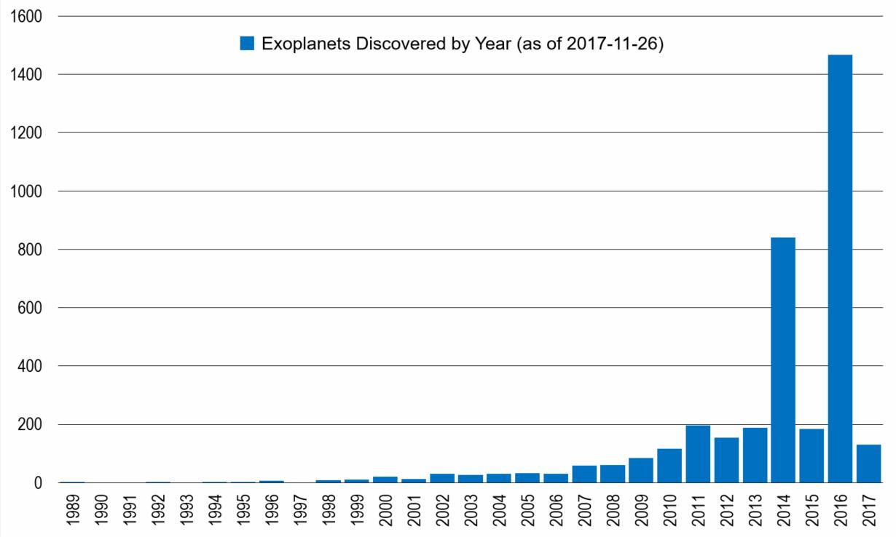

---

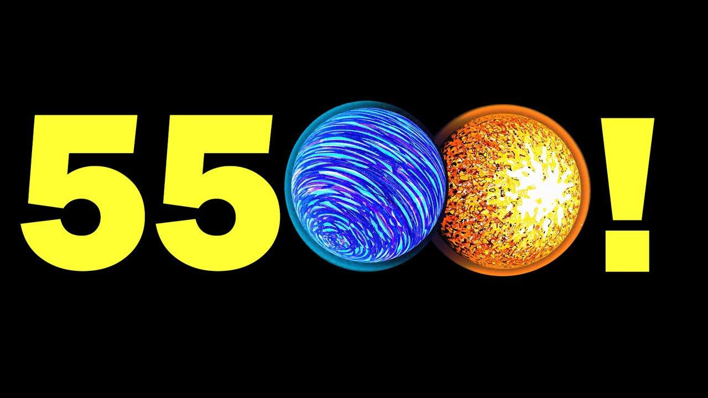

---

<!-- _header: . -->
<!--_paginate: true -->

# 怎么找星星
## 
## 探测系外行星方法有多种：
* 视向速度法 (Radial Velocity Method)
* 天体测量方法 (Astrometry Method)
* 凌星法 (Transit Method)
* 引力透镜法 (Gravitational Microlensing Method)
* 直接照相 (Direct Imaging)
* 脉冲星计时（Timing)

---

<!-- _header: . -->
<!--_paginate: true -->

# 视向速度法

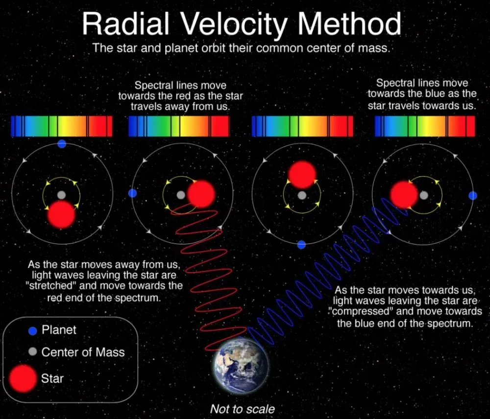

### 视向速度法也被称为多普勒光谱法
#### 其基本公式是：

## $v_r = \frac{{\Delta \lambda}}{{\lambda}} c$

##### 其中：$v_r$是恒星的视向速度，$\Delta \lambda$是观察到的波长变化，$\lambda$是发射源的原始波长，

---

---

<!-- _header: . -->
<!--_paginate: true -->

# 天体测量方法

### 右图为第一个用天体测量方法发现的行星
#### （注：这一发现不为后来的视向速度法观测证实，存疑）
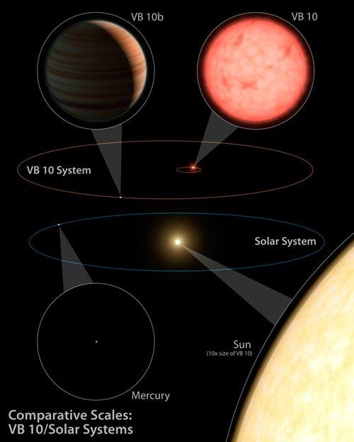

---

<!-- _header: . -->
<!--_paginate: true -->

# 凌星法

### 神中神：目前系外行星探测效率最高的方法

#### 光度流强差可以按照面积估计: 
##### $\Delta F_*=(R_P/R_*)^2$

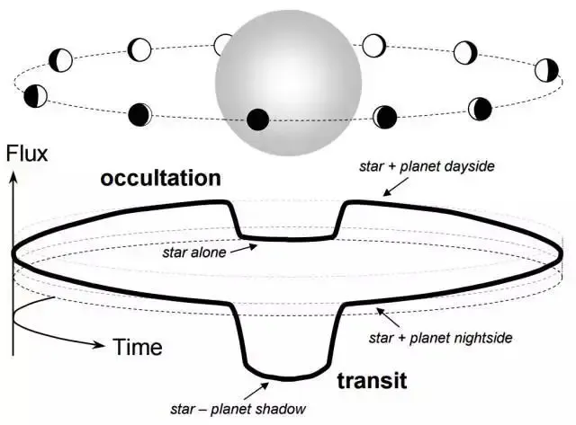

---

<!-- _header: . -->
<!--_paginate: true -->

# 凌星法

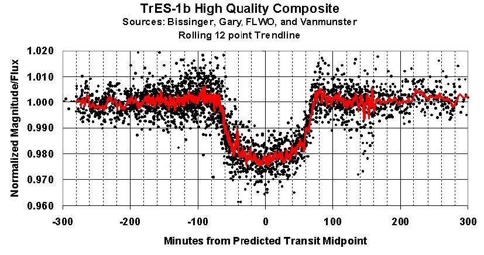

#### 1. **基线**
#### 2. **凌入**
#### 3. **凌星**
#### 4. **凌出**
#### 5. **光变曲线的深度**
#### 6. **凌星周期**

---

<!-- _header: . -->
<!--_paginate: true -->

# 凌星法

## 问题：如何区分行星凌星的光变曲线和双星掩食的光变曲线？
* 行星凌星的光变曲线一般每次凌日光谱的吸收是一样的程度
* 双星掩食的光变曲线会有两个不一样的吸收峰
* 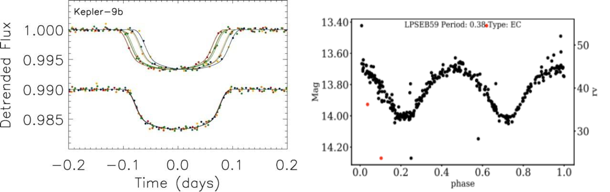

---

<!-- _header: . -->
<!--_paginate: true -->

# 引力透镜法

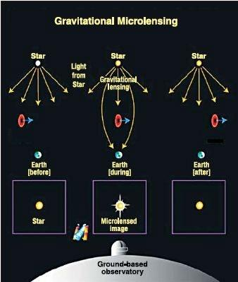
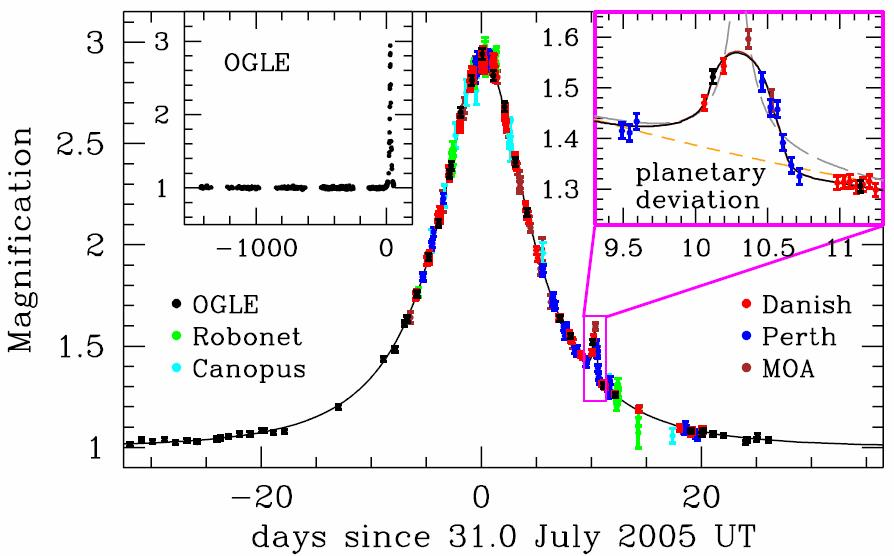

---

<!--_paginate: true -->

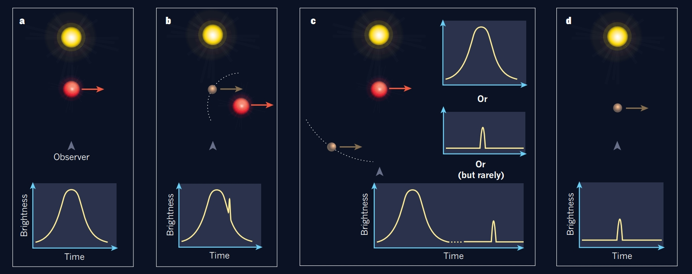

---

<!-- _header: . -->
<!--_paginate: true -->

# 直接照相法

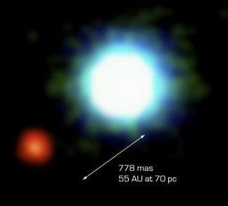

右图为第一个证实的直接照相法发现的行星，母星是褐矮星2M1207

---

<!-- _header: . -->
<!--_paginate: true -->

# 脉冲星计时法

#### 1992年A.Wolszczan和D.A.Frail这俩哥们利用脉冲星计时发现了两颗环绕脉冲星（中子星）的行星级天体，这是首次人类发现太阳系之外的行星。

---

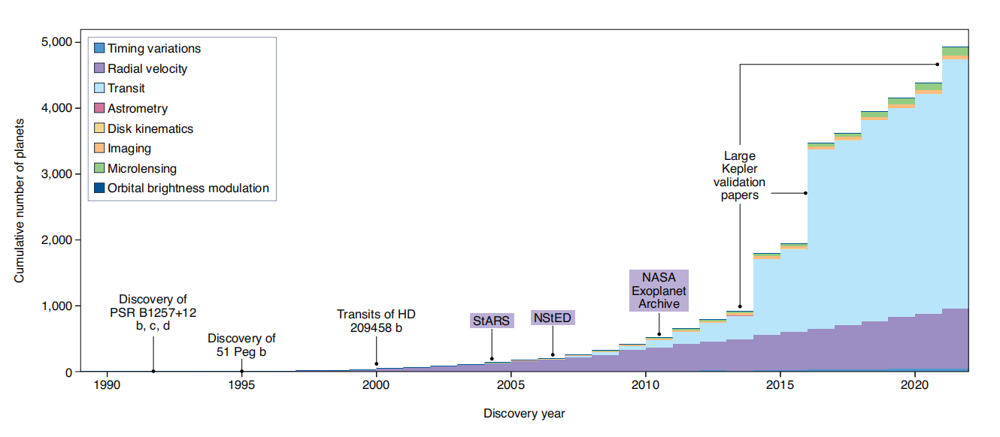

---

<!-- _header: . -->
<!--_paginate: true -->

# 探测技术对比

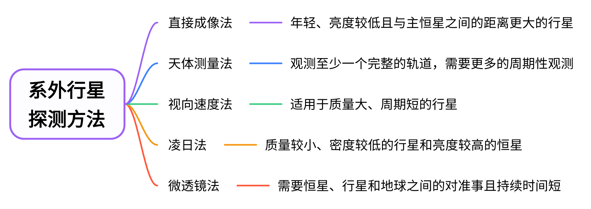

---

<!-- _header: . -->
<!--_paginate: true -->

# HD 209458b

* 首个凌日法发现的系外行星
* 首个已知有大气的
* 首个观测到有蒸发中的氢气层的，以及其大气成分含有氧和碳的。
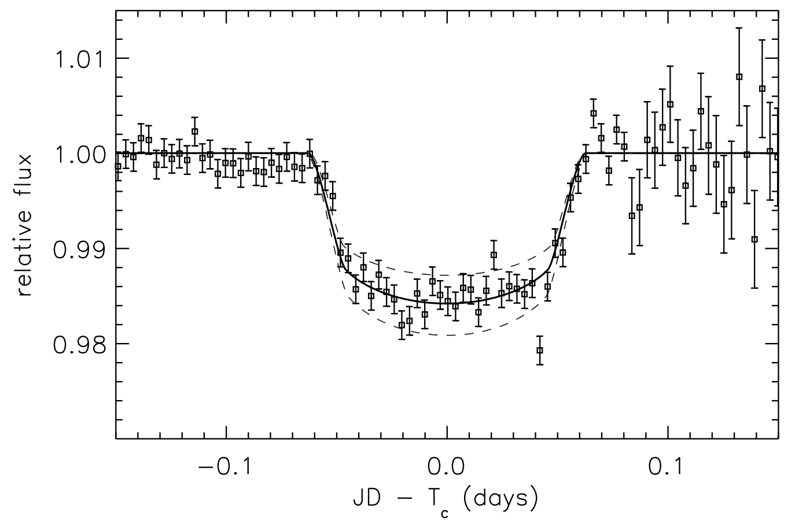

---

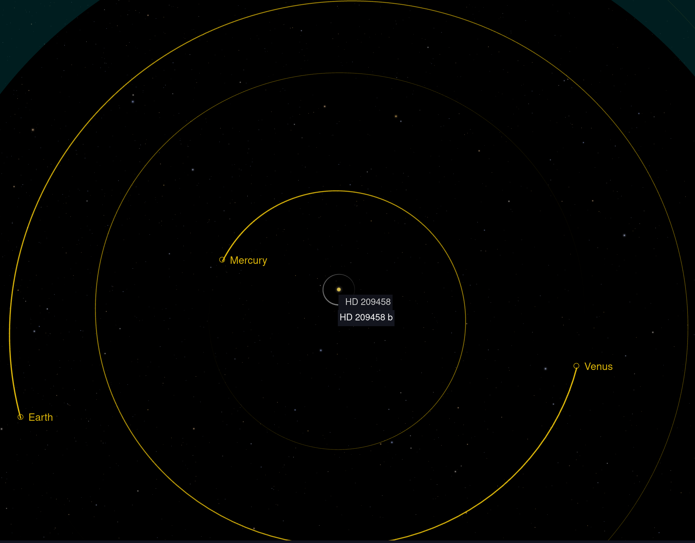

---

<!-- _header: . -->
<!--_paginate: true -->

# HD 209458b

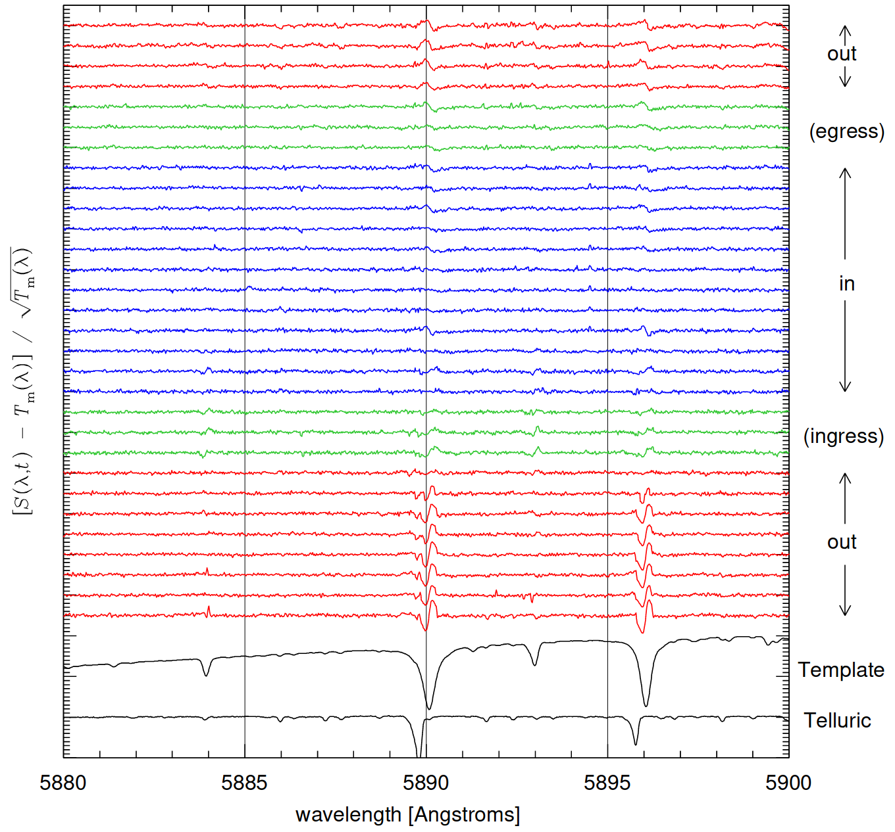

## HD 209458b的透射光谱中探测到了Na元素。行星大气中为什么会有Na，产生途径有哪些？为什么我们关心Na的谱线？

### 1.产生途径包括HD209458b 内部的含 Na 的化合物逸散到大气中。流星体，太阳风等星外物质携带Na元素进入
#### 2.一般而言，钠元素具有双线吸收的谱线，通过观测凌星时的光谱变化，可以研究系外行星大气中是否存在钠吸收。其吸收谱很容易被观测到且相当显著，故是一种很好的标志物。

---

<!-- _header: . -->
<!--_paginate: true -->

# HD 209458b
## Is there NaI in the atmosphere of HD 209458b?
* 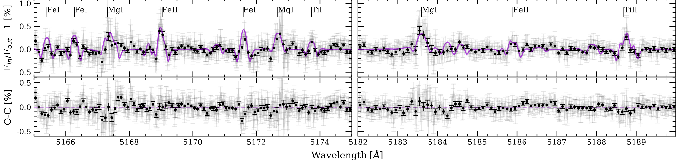

---

<!-- _header: . -->
<!--_paginate: true -->

# RM&CLV effects 

_effect.gif)

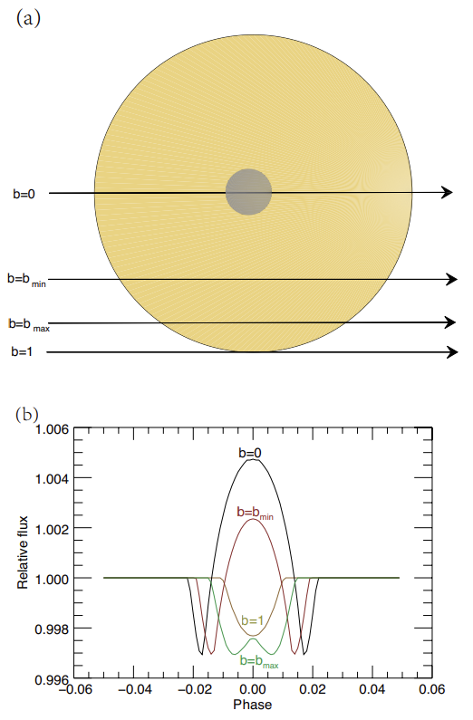

---

<!-- _header: . -->
<!--_paginate: true -->

# GJ 1214b

## 在超级地球GJ 1214b上，有研究发现了其存在水云，他们是如何确认上面有水云的？大望远镜＋高分辨率的光谱在这方面的研究中发挥了什么样的作用？

---

<!-- _header: . -->
<!--_paginate: true -->

# GJ 1214b

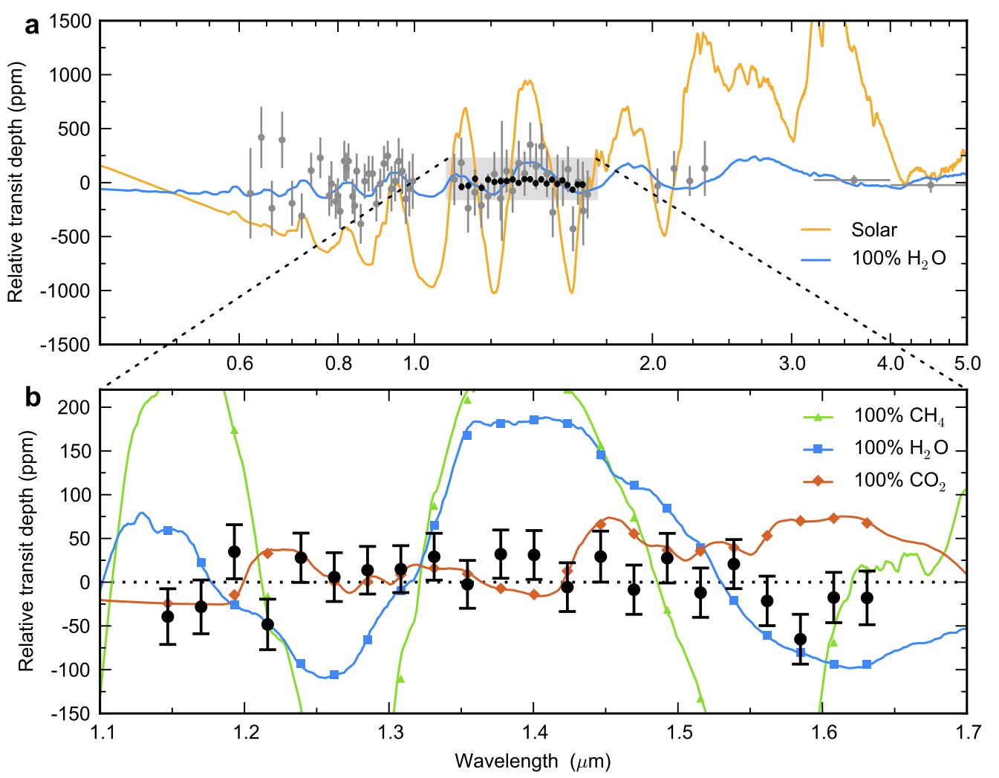

芝加哥大学的Laura Kreidberg, Jacob L. Bean等人的研究排除了GJ 1214b的无云大气模型，并提出这颗行星的大气层必须包含云，才能与数据一致。

---

<!-- _header: . -->
<!--_paginate: true -->

# GJ 1214b

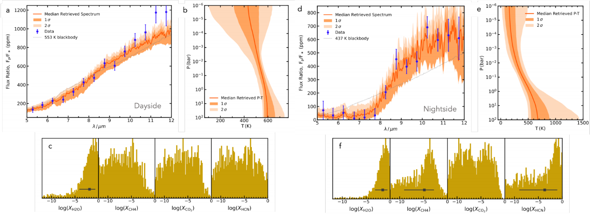

### 从哈勃(2014)到詹姆斯韦伯(2023)

---

<!-- _header: . -->
<!--_paginate: true -->

# Earth Similarity Index (ESI)

$$ESI = \prod_{i=1}^{n} \left(1 - \frac{|x_i - x_{i0}|}{|x_i + x_{i0}|}\right)^{w_i/n}$$

其中:

・$x_i$ 是行星的某个性质
・$x_{i0}$ 是地球上对应性质的参考值
・$w_i$ 是该性质的权重
・$n$ 是行星性质的总数量

---

<!-- _header: . -->

# ESI

* 47 个半径大于 100 公里的太阳系天体（红色圆圈）和 258 个太阳系外行星（蓝色方块）的地球相似性指数

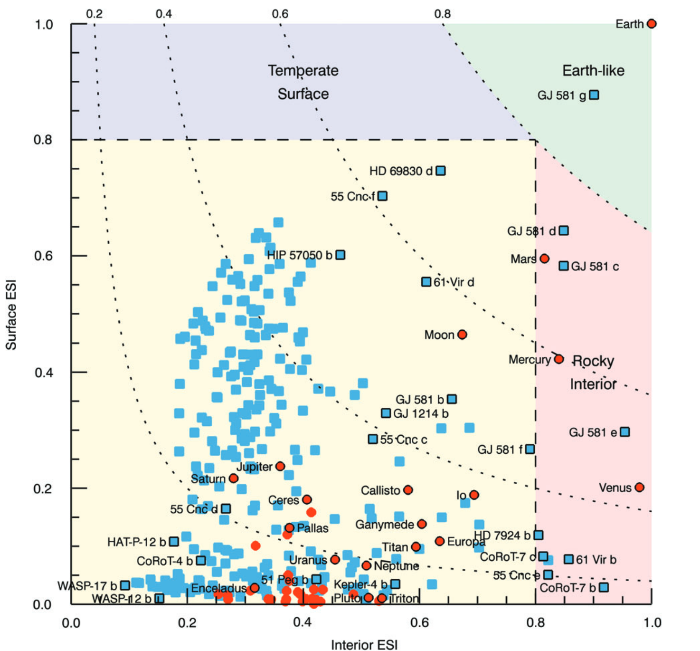

---

<!-- _header: . -->
<!--_paginate: true -->

# 参考文献

## 
##
##
#### 1. Schulze-Makuch, D. et al. A Two-Tiered Approach to Assessing the Habitability of Exoplanets. Astrobiology 11, 1041–1052 (2011).
#### 2. Kreidberg, L. et al. Clouds in the atmosphere of the super-Earth exoplanet GJ 1214b. Nature 505, 69–72 (2014).
#### 3. Charbonneau, D., Brown, T. M., Latham, D. W. & Mayor, M. Detection of Planetary Transits Across a Sun-like Star. Preprint at https://doi.org/10.1086/312457 (1999).
#### 4. Jagadeesh, M. K. Earth Similarity Index and Habitability Studies of Exoplanets. Preprint at http://arxiv.org/abs/1801.07101 (2018).
#### 5. Casasayas-Barris, N. et al. Is there NaI in the atmosphere of HD 209458b? Effect of the centre-to-limb variation and Rossiter-McLaughlin effect in transmission spectroscopy studies. A&A 635, A206 (2020).
#### 6. Narita, N. et al. Subaru HDS Transmission Spectroscopy of the Transiting Extrasolar Planet HD 209458b. Publications of the Astronomical Society of Japan 57, 471–480 (2005).

---

<!-- _header: . -->
<!--_paginate: true -->

# 参考文献

##
##
##
####
#### 7.Wolszczan, A., Frail, D. A planetary system around the millisecond pulsar PSR1257 + 12. Nature 355, 145–147 (1992). https://doi.org/10.1038/355145a0
#### 8.王佳琪,王汇娟等.太阳系外行星探测研究进展[J].天文学进展,2021.DOI:10.3969/j.issn.1000-8349.2021.01.01. 
#### 9.LAMOST简报2020年第9期
#### 10.Wambsganss, J. Bound and unbound planets abound. Nature 473, 289–291 (2011). https://doi.org/10.1038/473289a
#### 11.Effect of the stellar absorption line centre-to-limb variation on exoplanet transmission spectrum observationsF. Yan, E. Pallé, R. A. E. Fosbury, M. G. Petr-Gotzens and Th. HenningA&A, 603 (2017) A73,DOI: https://doi.org/10.1051/0004-6361/201630144
#### 12.Kempton, E.MR., Zhang, M., Bean, J.L. et al. A reflective, metal-rich atmosphere for GJ 1214b from its JWST phase curve. Nature 620, 67–71 (2023). https://doi.org/10.1038/s41586-023-06159-5

---

<!--_paginate: false -->

